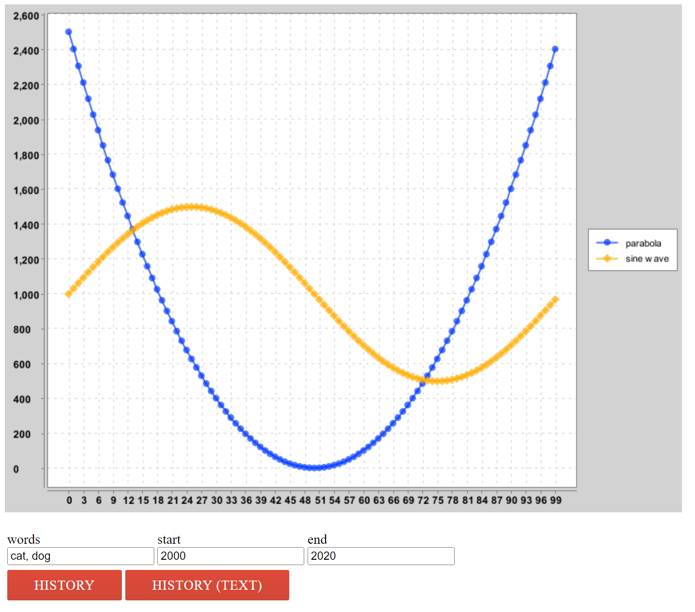

# NGordnet (NGramm + Wordnet) 
- A browser-based tool for exploring the history of word usage in English texts. The screenshot below visualizes its function on the webpage.

The technical project I'm most proud of is project 2 I did while studying CS 61B, which is called NGordnet (NGramm + Wordnet).

In this project, I built a browser-based tool for exploring the history of word usage in English texts and visualizing it on the website. The reason I am so proud is that I applied various data structures learned in class and ensured the complexity (runtime) of each data structure is the most efficient. For example, I used HashMap to store English Texts and PriorityQueue to find the most popular words in a specified year. At the same time, I developed my self-learning ability when doing this project. I used many methods and Java syntax that I hadn’t learned in class and cultivated the ability to quickly understand multiple complex java libraries (this is the core idea of software engineering). So, I believe that this self-learning ability will help me solve any difficult problems that I will encounter in the future.

